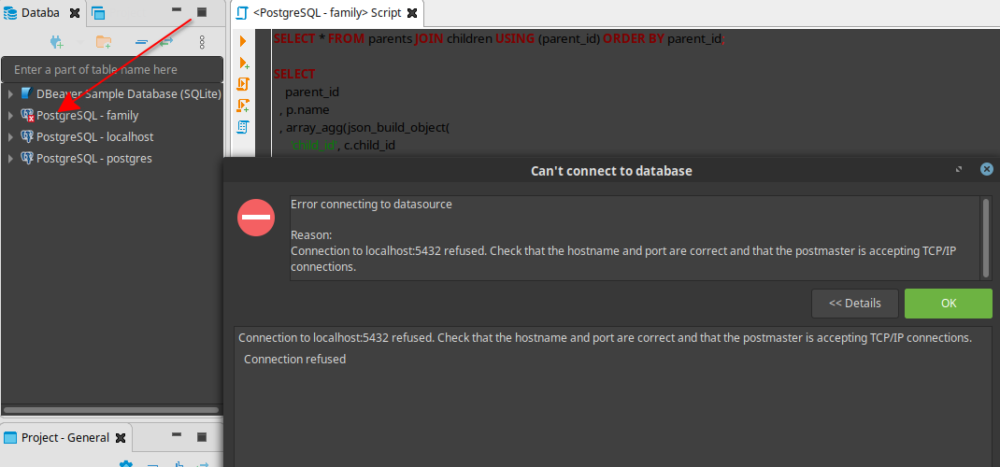

Recap from our last [post](/blog/docker-postgresql/), if you open up you database client, DBeaver for instance. You will get the following error.



Simply because we have not started docker service hence the postgres container is not up and running.

You may want to start some of your containers at system boot.These are some of the applications that you use frequently and therefore you wish that everytime you are interacting with them, they are up and running!

### Containers you may wish to start automatically

1. [PlantUML Server](https://hub.docker.com/r/plantuml/plantuml-server/)

Docker server container to render [code as diagrams](https://real-world-plantuml.com/) or is it vice versa! (Diagrams as Code)

Check the references at the bottom of this post if you want to delve deeper into this subject.

2. [PostgreSQL](https://hub.docker.com/_/postgres/)
3. [GatsbyJS](https://hub.docker.com/r/gatsbyjs/gatsby/)

I will use [systemd](https://freedesktop/wiki/software/systemd), process manager to automate this.

### Step 1: Start the Docker Service

```bash
$ sudo systemctl  start docker
```
Then confirm it is up and running `sudo systemctl status docker`

Type `docker ps -a` to see which containers are running, note the one you want to automate.
Mine is called `docker-postgres_database_1`.But this name needs to change, simply because I won't be able to know which is which once I have more containers with database.So type this to rename it

```bash
$ docker rename docker-postgres_database_1 family_database
```
Confirm the change `docker ps -a`. Yes, It has changed, I can see the output.
Note the name `family-database` we will use it in the next step.

### Step 2: Create the Service File
Then, change directory to the one shown below
```
$ cd /etc/systemd/systemd/
```
While inside that folder create a file.Mine I called it `docker-family-database.service`
Here is the command
```bash
$ sudo touch docker-family-database.service
```
Use vim or Gedit to open that file.
```bash
$ sudo gedit docker-family-database.service
```
Then paste the following content and save the file.

```
[Unit]
Description=Family Database Container
Requires=docker.service
After=docker.service

[Service]
Restart=always
ExecStart=/usr/bin/docker start -a family-database
ExecStop=/usr/bin/docker stop -t 2 family-database

[Install]
WantedBy=local.target
```


### Step 3: Activate the Service File
First reload the unit file we created.Run this command everytime you do a modification to your unit file.

```
$ sudo systemctl daemon-reload
```

Then activate the service run by typing the following commands

```
$ sudo systemctl start docker-family-database.service
$ sudo systemctl enable docker-family-database.service
```
Your terminal output should be something similar to this.

```
josphat@localhost ~]$ sudo systemctl enable docker-family-database.service
Created symlink /etc/systemd/system/local.target.wants/docker-family-database.service → /etc/systemd/system/docker-family-database.service.

```
Whenever you want to stop the service, here are the commands

```
$ sudo systemctl stop docker-family-database.service
$ sudo systemctl disable docker-family-database.service

```
### Step 4: Verify your Service is Running

Reboot
```bash
$ sudo reboot
```
Then after you system is up, Open Dbeaver Client and Verify if the **Database Connection Error** is displayed,as shown by the screenshot on the top of this post.

If you were able to connect to your database, then your service is running, in short, you have automatically started postgres docker container at system reboot.


### TODO:
I will definately remove these references from this post and create another post for Diagram As Code.

### References
Although this article is about autostarting docker container, I thought I should list some important reference here for someone who may wish to pursue diagram as code topic later.

If you wish to learn more on this Diagram As Code.Here are a few resources,I found online.

- [How to edit Markdown and UML in Visual Studio Code](https://www.freecodecamp.org/news/inserting-uml-in-markdown-using-vscode/)
- [Create Cloud-Based Diagrams with Python](https://diagrams.mingrammer.com/)
- [Still More Plant UML Diagrams](https://ogom.github.io/draw_uml/plantuml/)
- [Everything As Code!](https://hackernoon.com/everything-as-code-explained-0ibg32a3)

References for this post
- [Start Docker Containers Automatically](https://mehmandarov.com/start-docker-containers-automatically/)
